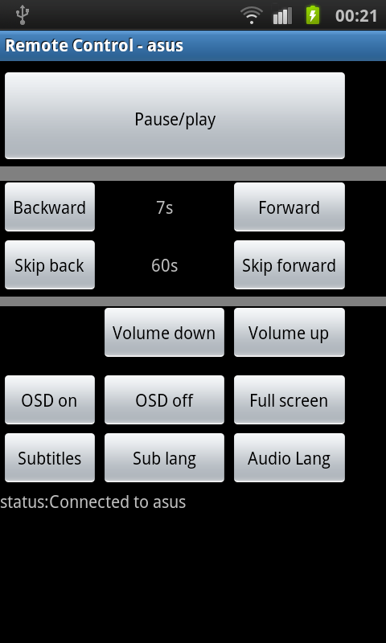

<!-- -*- mode: markdown -*- -->

Carrie Remote Control
=====================

Introduction
------------

This is a remote control tool to control media playback via network commands. The media player must be a Linux machine and the controller can be a web browser or Android device.

The players supported are:

- Youtube on Firefox or Chromium browser.
- BBC iPlayer on Firefox or Chromium.
- mplayer

This project is not a media center. There is no functionality for starting media playback or changing the file being played. `carrie` is used to control a video which is already playing. The default functions available are:

- Play/pause
- Toggle full screen
- Volume up annd down
- Mute

If the client player is `mplayer` these additional functions are available:

- Skip forwards/backwards
- Toggle fullscreen, OSD, subtitle visibility
- Change subtitle language.

Screenshots
-----------

See the `docs` directory.

How does it work?
-----------------

`carrie` is a process running on the machine doing the media playback. It opens a port (5505 by default) and supplies a simple web interface. Alternatively the `carrie` Android application can send commands to the same port.

When a command is received the server will attempt to control a web browser showing Flash video. If one is not found then the server will try to control mplayer via a FIFO object - this uses the 'slave mode' feature of `mplayer`. `mplayer` must be configured in advance to listen on the FIFO.

Limitations
-----------

Since there is no API for communicating with Flash video, the server process sends fake mouse events for control. This has to be configured for each combination of browser and video site.

Why not just use x/y/z remote control instead of this?
------------------------------------------------------

There are other remote controls for Android devices. `carrie` is for users who already have another method they use to start media playback, and just want to add a remote function.

Other remote controls I would recommend are:

- sshmote: A media center for Android. Does not need any special server software except a Unix compatible OS running an SSH server.
- teamviewer: Take control of a Windows or Linux machine from a web browser or phone.

Requirements
------------

To run the server:

- Python 2.7+ (programming language)
- Flask (lightweight Python web server framework)
- xdotool (command line tool to fake mouse and keyboard events)
- xwininfo (command line tool to read window information)

To control the server:

- Any modern web browser

To use the mobile phone applet:

- Android device running Android Froyo or later

Server installation
-------------------

First install the server:

    > git clone xxx
    > cd xxx
    > python setup.py build
    > sudo python setup.py install

To configure `mplayer` edit `$HOME/.mplayer/config` and add this line:

    input=file=/tmp/mplayer.fifo

Any new instances of mplayer will connect to the FIFO and listen to commands. This doesn't affect normal mplayer usage. The FIFO will be created when the server starts up, or maually with:

    > mkfifo /tmp/mplayer.fifo

Android application installation
--------------------------------

This project includes the Android application source in the `android` directory and a precompiled `carrie.apk` file for quick installation. It requires internet access permission to make connections to the server.

Start the server
----------------

Run:

    > carrie

This will start up the server, running in the foreground, listening on port 5505, using a FIFO on /tmp/mplayer.fif to communicate with mplayer. The FIFO will be created if it doesn't already exist.

Run:

    > carrie -h

to see available options.

To run in the background use:

    > nohup carrie 2>&1 > /dev/null &

Control via browser
-------------------

Open a web browser and visit: "http://<server>:5505"

Control from Android device
---------------------------

Install the Android application, either by compiling from source or using the precompiled `carrie.apk` from this repository. Press the MENU button and enter the name or IP address or the media player. 

The application it requires the Android "Internet Access" permission because it needs to connect to the server.

Development - server
--------------------

May wish to install:

- python-pip
- python-distribute

Development - Android application
---------------------------------

On Debian install: android sdk (manually), ant, openjdk-6-jdk, optionally Eclipse.

Compiling and installing the code should be the same as a standard Android application - either use Eclipse, or command line tools.

Directory layout
----------------

- android/
  Android controller application
- carrie/
  Python HTTP server code
- bin/
  Startup script
- README.md
  This file
- doc/
  Some screenshots
  
